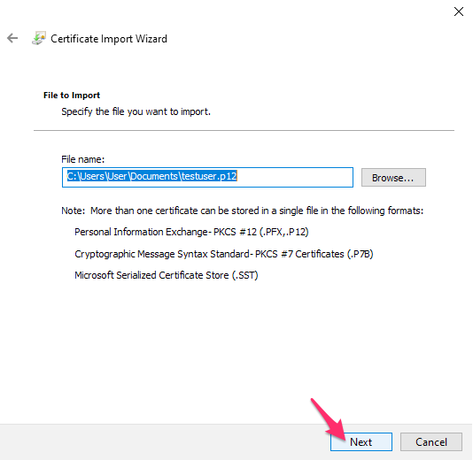
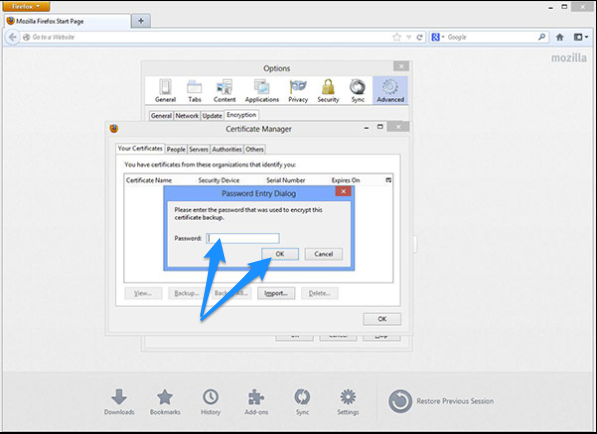

# Installation

This guide will help you to connect with your your lab over your web browser.

::: warning Requirements

- Working VPN and SSH as configured in the [Getting started](/getting-started/) guide.

:::

The new connection requires a certificate on your local machine to ensure encrypted and trustworthy communication.

::: tip Time estimate

Allow for **30 minutes** to complete this installation and some time to play around in your new environment.

:::

[Contact us](/contact) to request certificate for your new web access if your are an existing lab user. New users will receive certificate for browser access as part of their regular onboarding.

::: warning

Currently available to NTNU users only.

:::


## 1. Install certificates


::: details Windows

1. Open the p12 certificate. Make sure the store location is set to Current User and click next:

   

2. Continue clicking on next

   

3. Fill in the passphrase that you received on signal, and make sure only the same option is checked exactly as in the image. Then click next:

   

4. Keep the first option to Automatically select the certificate store based on the type of certificate. Click next:

   

5. Your certificate is imported and you can hit finish:

   

6. Quit your browser and restart it again for the certificate to get recognized.

:::


::: details OS X and macOS

1. Open the system profile config (.mobileconfig) attached in archive.

2. Confirm the installation of profile.

3. Enter the passphrase that you received on signal and then confirm.

4. Quit your browser and restart it again for the certificate to get recognized.

:::


::: details Ubuntu Linux

1. Open Firefox on your local machine.

You can install Firefox on your local machine with the following code: `apt install firefox`.

2. Open url `about:preferences#privacy` or click `Edit` > `Preferences`.

   

3. Click Options > Advanced > Encryption. Click View Certificates.

   

4. Select the Your Certificates tab. Click Import.

   

5. Browse for and select your PFX file. Enter the password.

   

6. Click OK.

   

7. Restart Firefox.

The certificate is now installed and can be used for network or secure web site client authentication after the restart of Firefox.

:::

## 2. Edit hosts file

We are sending hosts file record on email. You will need to make sure that your hosts file contains this line.

Example of hosts file record:
```
10.42.130.X <lab_name>.lab.hdc.ntnu.no
```

::: details Windows

  1. Press the Windows key.

  2. Type `Notepad` in the search field.

  3. In the search results, **right-click** Notepad and select Run as administrator.

  4. From Notepad, open the following file:

  ```
  c:\Windows\System32\Drivers\etc\hosts
  ```

  5. Add the line that you received from us on email.

  6. Select `File` > `Save` to save your changes.

:::

::: details OS X and macOS

  Edit `/etc/hosts` file in your preferred text editor, and add the line that you received from us on email.

  Example with vim:

  ```
  sudo vim /etc/hosts
  ```

:::

::: details Ubuntu Linux

  Edit `/etc/hosts` file in your preferred text editor, and add the line that you received from us on email.

  Example with vim:

  ```
  sudo vim /etc/hosts
  ```

:::

## 3. Open your new Workbench

1. Open the your web browser (Firefox is required for Linux).

2. Type in the URL address to your lab in your browser.

```bash
# -- Principal example
https://<labname>.lab.hdc.ntnu.no

# -- Demo example
https://demolab.lab.hdc.ntnu.no
```

3. Sign in with your HUNT Cloud lab username and lab password. This is the password that you made on your first login.

4. With a little bit of luck you should now see your new workbench. Click around and play in your new world.

  


## Immediate troubleshooting

#### I don't remember my password

Don't worry. [Contact us](/contact) on email for a password reset.
